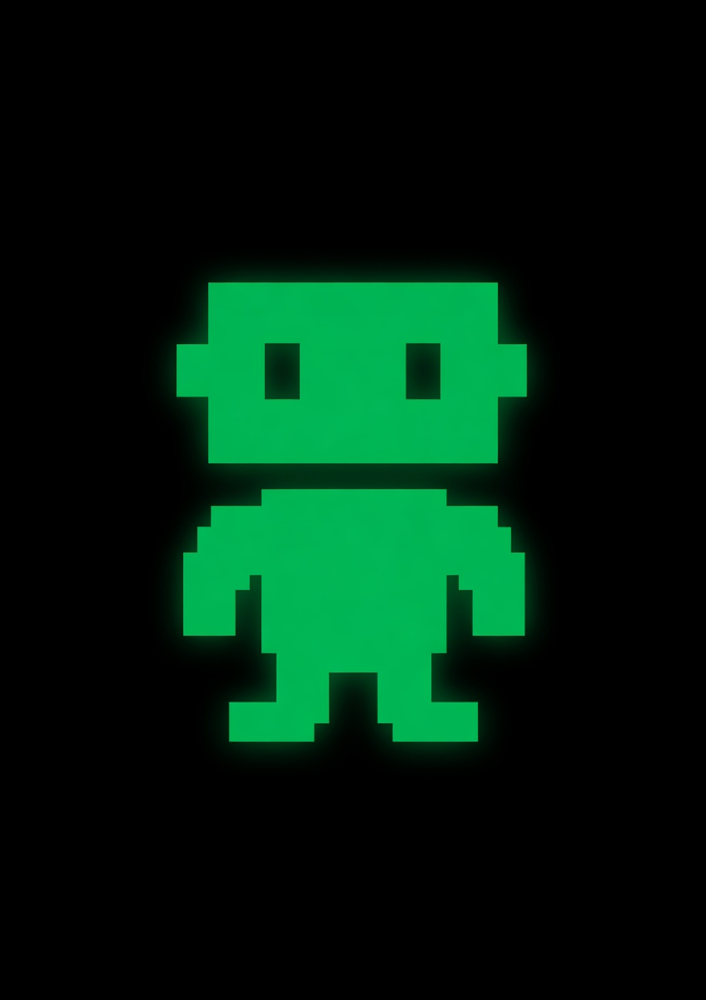

<p align="center">
  
</p>

<h1 align="center">Alaude</h1>
<p align="center"><em>A desktop AI assistant for your computer — not your browser tab.</em></p>

<p align="center">
  
  
  
  
</p>

---

## What this is

Alaude is an Electron desktop app that talks to any LLM you can point it at. A single AI surface that:

- Runs models **locally** (via Ollama) when the prompt shouldn't leave the machine
- Routes to **cloud models** (Claude, GPT-4, Gemini, GLM-5.1, Qwen, etc.) when heavier horsepower is needed
- Exposes **domain-specific "Spaces"** — Health, Finance, Legal, Real Estate, Education, Marketing — each with its own system prompt and quick-actions, instead of the same prompt box for every task
- Watches itself and surfaces **what's slow / broken / under-used** via a built-in OODA loop
- Can actually *run commands, write files, and open browser tabs* when given a workspace folder — not just chat

---

## Features

### 🦙 Local models (via Ollama)
First-class support for running models on-device. In-app catalog for **Qwen 3.6**, **Gemma 4** (E2B/E4B/26B/31B), **Llama 3.2/3.3**, **DeepSeek R1**, and anything else with an Ollama tag. One click to download, progress bar, cancel button. Once installed, the model shows up in the dropdown alongside cloud models.

### ☁️ Cloud providers
Anthropic, OpenAI (GPT-4, o3, o4), Google Gemini, xAI Grok, Moonshot Kimi, Alibaba Qwen (DashScope), Zhipu GLM-5.1. API keys stored in `~/.claude/.credentials.json` with mode `0600`.

### 🧭 Spaces — domain-tuned AI modes
Seven built-in Spaces with tuned system prompts and quick-actions:
- **General** — the default
- **Health** — lab result analysis, drug interaction checks, PHQ-9 / GAD-7 screening, BMI/BMR calculators
- **Finance** — budgets, invoices, P&L analysis, cash-flow forecasts
- **Real Estate** — property analysis, MLS listings, investment ROI
- **Legal** — contract review, NDA drafting, compliance checks
- **Education** — lesson plans, quizzes, grading, study guides
- **Marketing** — social posts, email campaigns, SEO, ad copy

Plus: custom Spaces you can create in-app — each gets its own system prompt, placeholder, and quick-actions.

### 🛠️ Tool calling
Models can actually do things in a workspace folder you pick:
- `read_file`, `write_file`, `list_directory`
- `run_command` — shell commands
- `open_in_browser`, `start_dev_server`

Enabled for capable models (Claude, GPT-4+, o-series, Gemma 4, Qwen 3.6, Llama 3.3, etc.). Disabled for tiny models that can't format tool calls reliably (Gemma 3 1B, Llama 3.2 1B/3B, DeepSeek R1 distills). Live activity chips show each tool call as it happens.

### 📊 UX OODA loop
Every interaction is logged locally (`~/.claude/alaude-events.ndjson`) with a composite health score. Every 10 outcomes, a priority-ordered analyzer runs six diagnose rules:

1. High error rate on a provider
2. High retry rate on a space × model pair
3. Quick-action abandonment
4. Provider latency outliers / high model-switch rate
5. Underused quick-actions
6. Healthy fallback

Proposals land in `~/.claude/alaude-ux-proposals.md` — **never auto-applied** (iron law: humans decide anything affecting UX copy). An in-app dashboard (**📊 Insights** button) shows the current health score, dimensional breakdown, and the latest diagnosis.

### ✨ Chat polish
- Real markdown rendering (headers, bullets, bold, inline code, links, fenced code blocks with copy buttons and language tags)
- Hover-to-copy every response
- Smart auto-scroll — won't yank you down when you scroll up to re-read
- Keyboard shortcuts: `⌘K` focus input, `⌘N` new session, `Esc` close modals
- Voice input (Web Speech API)
- File attachments (PDF, DOCX, XLSX, images, plain text)
- Drag-and-drop

---

## Architecture

Three processes, three concerns:

```
┌─────────────────────┐    IPC    ┌─────────────────────┐   JSON/stdio   ┌──────────────────┐
│  Renderer           │ ────────> │  Main (Electron)    │ ─────────────> │  API Worker      │
│  renderer/          │ <──────── │  electron/main.js   │ <───────────── │  (plain Node)    │
│  index.html         │           │                     │                │  api-worker.js   │
└─────────────────────┘           └─────────────────────┘                └──────────────────┘
  UI + user events                  IPC routing, file ops,                 Talks to LLM
                                    Ollama pull/list/remove,               providers,
                                    credential storage                     executes tools
```

Why the worker? Electron's `ELECTRON_RUN_AS_NODE` mode had a nasty interaction with a VPN's DNS resolver that made `api.openai.com` and `api.anthropic.com` unreachable. The worker runs under the system's `node` binary with a custom `dns.lookup` monkey-patch that falls back to `8.8.8.8` / `1.1.1.1` when the system resolver whiffs. Bonus: heavy LLM work doesn't block the UI process.

### Key files

| Path | What it does |
|---|---|
| `electron/main.js` | Window creation, IPC handlers, worker spawn + lifecycle, credential storage, OAuth PKCE flow |
| `electron/api-worker.js` | Chat request handling, DNS patch, provider routing, tool call execution |
| `electron/ollama.js` | HTTP wrapper around `localhost:11434` — list, pull (with progress), remove |
| `electron/model-catalog.js` | Curated list of downloadable local models (Qwen 3.6, Gemma 4, etc.) |
| `electron/ooda.js` | Event logger, batch analyzer, diagnose rules, proposal writer |
| `electron/spaces.js` | Built-in Spaces definitions |
| `electron/spaces-store.js` | Persistence for custom user Spaces |
| `electron/health/*` | Domain-specific tools: lab reference DB, drug interactions, PHQ-9/GAD-7, calculators, red-flag triage |
| `electron/preload.js` | contextBridge surface exposed to the renderer |
| `renderer/index.html` | Single-file UI: chat, Spaces, modals, dashboard |
| `docs/build-log.md` | Notes from the overnight build session where most of the app came together |

---

## Run locally

```bash
# Prerequisites
# - macOS / Windows / Linux
# - Node.js 18+
# - (Optional) Ollama for local models: https://ollama.com/download

git clone git@github.com:alsayadi/alaude-desktop.git
cd alaude-desktop
npm install
npm start
```

First launch will prompt for at least one API key (or you can skip straight to local models if Ollama is running).

**Build a distributable:**
```bash
npm run build:mac    # .dmg + .zip
npm run build:win    # .exe installer
npm run build:linux  # .AppImage + .deb
```

---

## Disclaimers

**Health Space is informational only.** Alaude's `analyze_lab_result`, `check_drug_interactions`, `score_phq9`, `score_gad7`, and related tools surface reference ranges and screening scores — they do not diagnose, prescribe, or replace qualified medical advice. The system prompt for the Health Space includes this reminder on every response. If you're reviewing real lab work or symptoms, see a clinician.

**API keys** are stored locally in `~/.claude/.credentials.json` (mode `0600`). They never leave your machine except as outbound requests to the respective providers.

**Telemetry** is local-only. The OODA loop writes interaction events to `~/.claude/alaude-events.ndjson` on your own disk. Nothing is sent to any remote service.

---

## Credits

- [Electron](https://www.electronjs.org/) — desktop shell
- [Ollama](https://ollama.com/) — local model runtime
- [@anthropic-ai/sdk](https://github.com/anthropics/anthropic-sdk-typescript), [openai](https://github.com/openai/openai-node), [@google/genai](https://github.com/googleapis/js-genai) — provider SDKs
- Model weights: Google DeepMind (Gemma), Alibaba (Qwen), Meta (Llama), DeepSeek, Z.ai (GLM-5.1) — under their respective licenses

Built with heavy assist from [Claude Code](https://www.anthropic.com/claude/code). The [build log](docs/build-log.md) covers the session that shipped most of the features listed above.

---

## License

[MIT](LICENSE)
