# Labaik / Alaude Desktop Architecture Study

Source inspected: `/Users/ahmed/Desktop/build/claude/alaude-desktop`

User-provided directory: `/Users/ahmed/Desktop/build/claude/alaude-desktop/build`

Version observed in `package.json`: `0.7.69`

This document is a deep study guide for the current Electron-based Labaik
desktop app. The `build/` directory you pointed to is not the core source
tree; it contains packaging assets such as the app icon, macOS entitlements,
and a small presentation generator. The live application source is primarily
in `electron/` and `renderer/`.

## 1. Executive Summary

Labaik is a local-first Electron desktop AI client. It has no app backend in
the normal chat path. The desktop app stores user data on the machine, reads
provider keys from local files or environment variables, and calls cloud AI
providers or local Ollama directly.

The app is split into three runtime zones:

- Main process: Electron windows, menus, tray, IPC, credentials, file dialogs,
  storage, MCP subprocesses, Ollama management, browser/screen tools.
- API worker: a plain Node child process that performs provider calls,
  streaming, tool loops, tool execution, and system-prompt assembly.
- Renderer: a large single-page HTML app plus several ES modules for memory,
  profile, task scope, and storage adapters.

The most important architectural idea is: renderer state drives the user
experience, main process gates OS capabilities, and the API worker owns the
model/tool loop.

## 2. Repository Map

```text
alaude-desktop/
+-- electron/
|   +-- main.js                 Electron main process and IPC hub
|   +-- api-worker.js           Provider calls, streaming, model tool loop
|   +-- preload.js              Safe renderer bridge: window.alaude
|   +-- preload-quick.js        Bridge for the menu-bar quick window
|   +-- provider-registry.js    Model-prefix -> provider routing
|   +-- permissions.js          Pure permission classifier
|   +-- paths.js                ~/.labaik path migration helpers
|   +-- json-store.js           Atomic JSON storage for renderer data
|   +-- mcp.js                  Minimal MCP stdio client and tool bridge
|   +-- browser-agent.js        Electron BrowserWindow browser tool
|   +-- screen-control.js       macOS click/type/key control helpers
|   +-- ollama.js               Ollama probe, pull, install, embed helpers
|   +-- skills.js               Scheduled routines / cron skills
|   +-- folder-skills.js        ~/.labaik/skills/*/SKILL.md discovery
|   +-- spaces.js               Built-in domain spaces and prompts
|   +-- spaces-store.js         Custom space persistence
|   +-- ooda.js                 Local UX event log and proposal engine
|   +-- health/                 Health calculators and safety tools
|
+-- renderer/
|   +-- index.html              Main UI, state, chat orchestration
|   +-- quick.html              Menu-bar quick chat UI
|   +-- js/
|   |   +-- bootstrap.js        Memory/profile wiring
|   |   +-- memory/             Memory store, extraction, recall, embeddings
|   |   +-- profile/            Always-on profile data
|   |   +-- storage/            fs-backed Storage adapter
|   |   +-- task-scope/         Per-session scoped workspace folders
|   +-- css/                    Memory and task-scope styles
|
+-- build/
|   +-- entitlements.mac.plist  macOS hardened runtime entitlements
|   +-- icons/icon.png          Packaged app icon
|   +-- ppt/                    Presentation generation assets
|
+-- scripts/
|   +-- notarize.js             Apple notarization hook
|   +-- ad-hoc-sign.js          Signing helper
|   +-- test-app.mjs            Smoke test helper
|   +-- test-modules.mjs        Module-level smoke test helper
|
+-- docs/                       Existing docs and this study
+-- dist/                       Packaged DMG/zip outputs
+-- labaik_design/              Brand/design source files
```

## 3. Source Size And Shape

Approximate inspected size, excluding `node_modules` and packaged `dist`:

| Area | Files | Notes |
|---|---:|---|
| `electron/` | 24 | Main process, worker, tools, local services |
| `renderer/` | 19-20 | Main HTML app plus ES modules |
| `build/` | 9 | Packaging and presentation assets |
| `docs/` | 8+ | Product docs, presentations, research |
| `scripts/` | 4 | Packaging/testing utilities |
| `labaik_design/` | 3 | Brand source |

Important line counts from the inspected files:

| File / Area | Lines | Role |
|---|---:|---|
| `renderer/index.html` | 17,418 | Main UI and most renderer orchestration |
| `electron/main.js` | 1,836 | Electron shell, IPC, worker bridge |
| `electron/api-worker.js` | 1,577 | Provider chat, streaming, tool loop |
| `electron/ooda.js` | 609 | Local UX observation loop |
| `renderer/js/memory/*` | about 930 | Memory extraction, recall, embeddings, UI |
| `electron/ollama.js` | 354 | Local Ollama runtime integration |
| `electron/permissions.js` | 304 | Tool permission classifier |
| `electron/mcp.js` | 236 | MCP server lifecycle and tool calls |

## 4. High-Level Context View

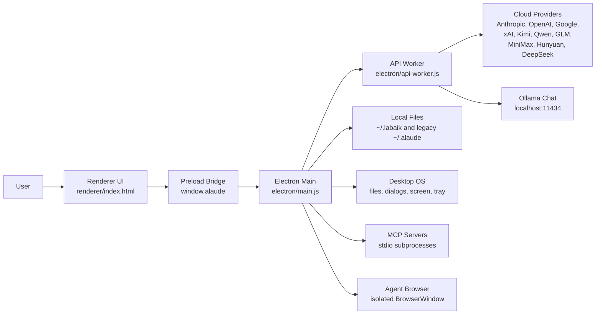

Key point: provider traffic leaves the user's machine directly from the API
worker. The app itself does not need a central Labaik service for chat.

## 5. Runtime Container View

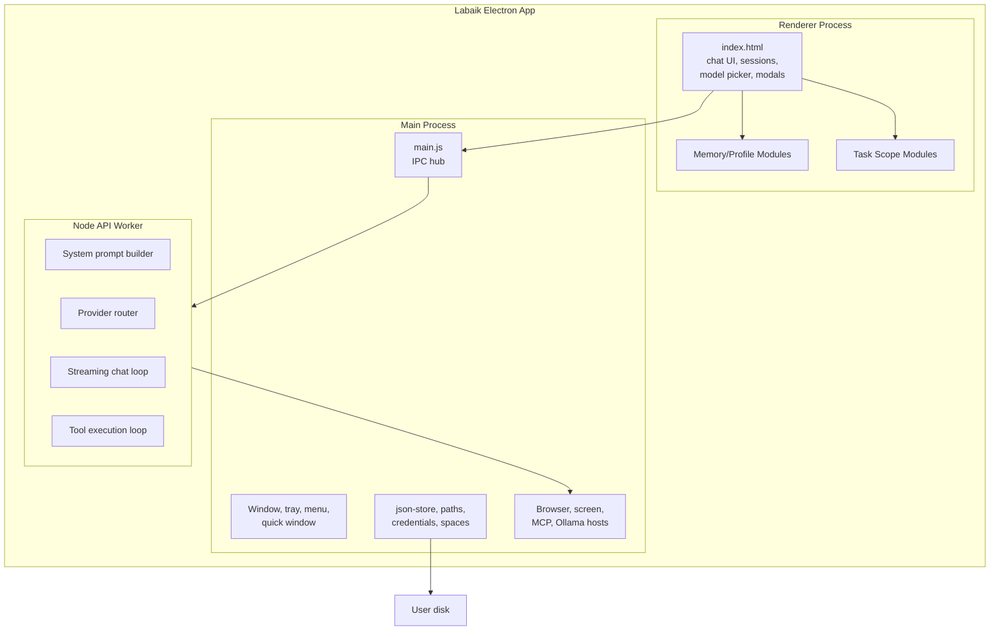

## 6. Main Process Responsibilities

`electron/main.js` is the control tower. It owns:

- Main BrowserWindow and quick BrowserWindow.
- macOS menu, tray, global shortcut.
- IPC handlers exposed through `preload.js`.
- Credential reads/writes.
- API worker spawn and JSON-line routing.
- MCP server lifecycle and tool execution.
- Browser-agent and screen-control tools.
- Ollama install/list/pull/embed operations.
- File dialogs and document ingestion.
- Scheduled skill execution.
- Dev-server process tracking.
- OODA event logging.

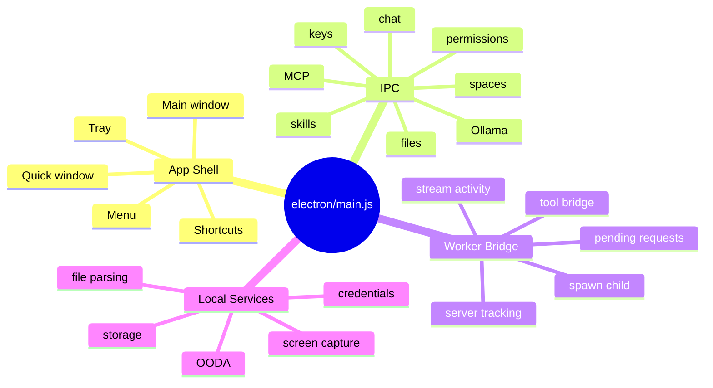

## 7. Renderer Responsibilities

The renderer is mostly one large app in `renderer/index.html`. It owns:

- Session list and active conversation.
- Input composer, attachments, screenshots, voice/read-aloud UI.
- Model picker and API-key UI.
- Streaming display and live tool activity chips.
- Multi-model modes: Crew and Council.
- Plan mode UI and approval flow.
- Memory/profile UI integration.
- Task Scope integration.
- Markdown rendering, rich blocks, Mermaid/charts/office exports.
- Conversation affordances: pin, save, copy, branch, rewind, search,
  minimap, daily digest, task board, heatmap, feedback journal.

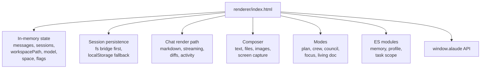

## 8. API Worker Responsibilities

`electron/api-worker.js` is the model execution engine. It runs as a child
process to avoid Electron network problems and to isolate crashes from the UI.

It owns:

- Provider selection using `provider-registry.js`.
- Credential lookup from local files and environment variables.
- System prompt construction.
- Rich-output prompt hints.
- AGENTS.md / CLAUDE.md injection.
- Browser-tools restraint instructions.
- Plan-mode prompt and tool disabling.
- Streaming response handling.
- Tool-call accumulation and argument validation.
- Up to 10 model/tool iterations per turn.
- Workspace tool execution.
- Main-process bridge calls for MCP, browser, and screen tools.
- Health-specific tool formatting and red-flag screening.
- Native Ollama chat path for thinking local models.

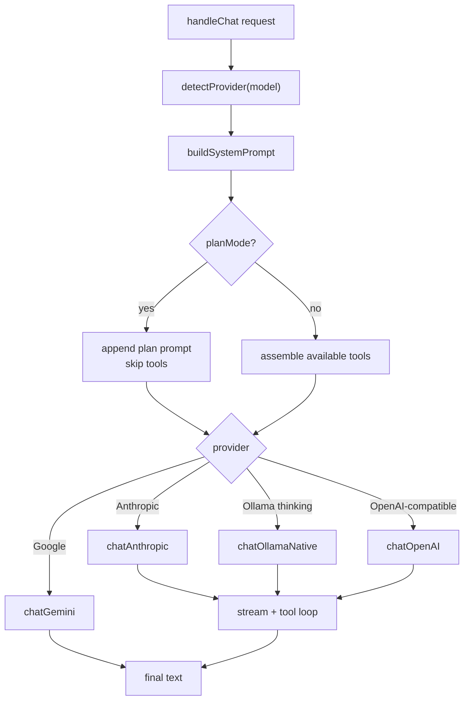

## 9. End-To-End Chat Sequence

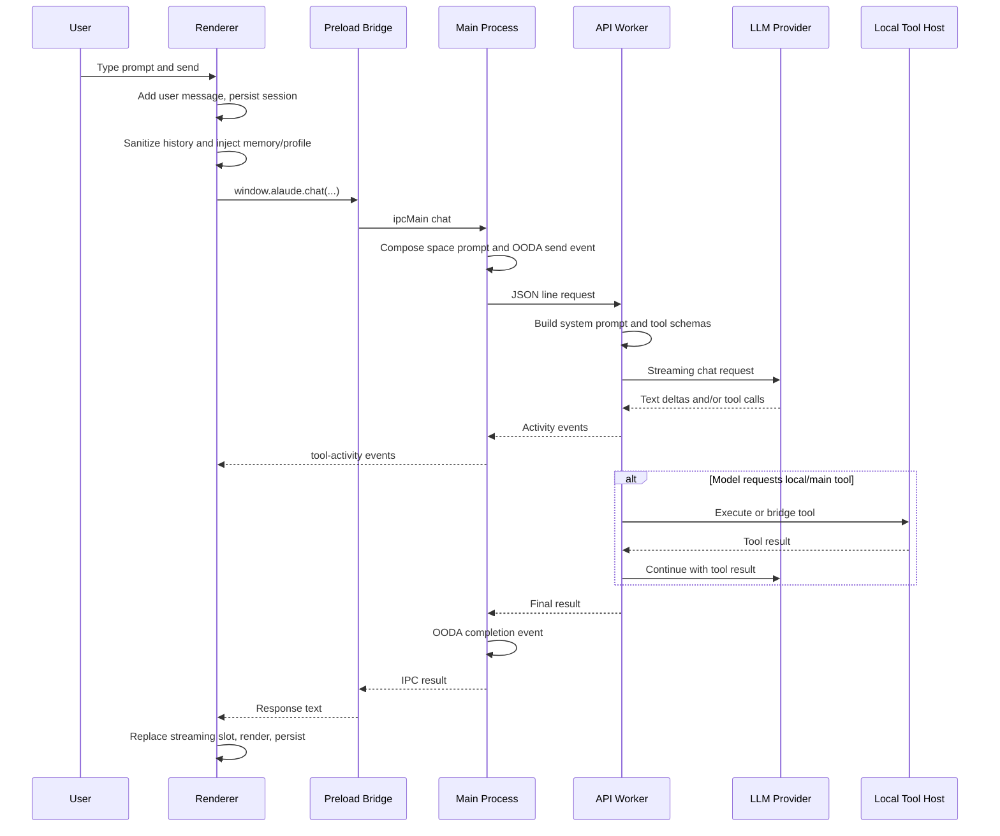

## 10. IPC Surface View

The renderer can only reach desktop capabilities through `preload.js`, which
exposes a controlled `window.alaude` object.

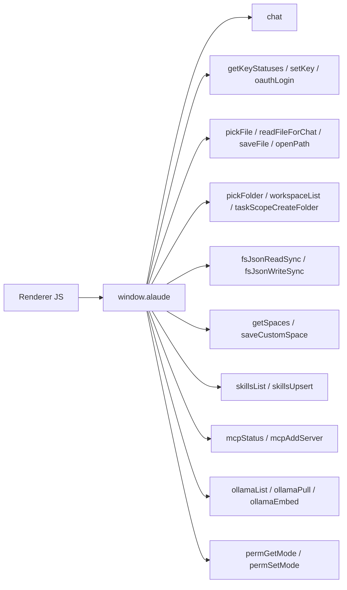

Why this matters: `nodeIntegration` is disabled and context isolation is on.
That means the renderer does not get raw Node filesystem access; main process
acts as the capability boundary.

## 11. Provider Routing System

`electron/provider-registry.js` is the single source of truth for mapping a
model id to a provider.

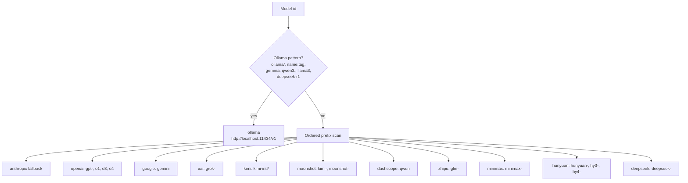

Provider design notes:

- Anthropic, OpenAI, and Google use their own SDK defaults.
- Most other cloud providers use OpenAI-compatible endpoints.
- Ollama is local and routes either through OpenAI-compatible `/v1` or the
  native `/api/chat` endpoint for thinking models.
- `normalizeModelId()` strips synthetic routing prefixes such as
  `kimi-intl/` and `ollama/` before calling upstream APIs.

## 12. Provider Call Paths

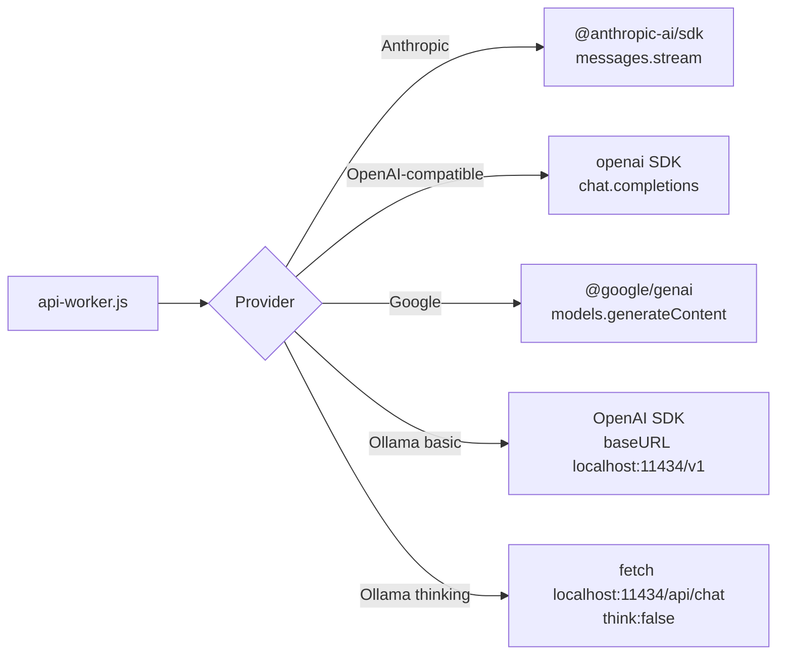

The native Ollama path exists because some local thinking models spend a lot
of time emitting reasoning tokens that the UI does not display. The native API
supports `think: false`, so the worker can make those models feel much faster.

## 13. System Prompt Construction

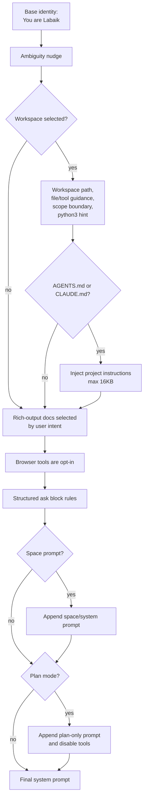

Important prompt behavior:

- Rich-output docs are only included when user wording hints at charts,
  Mermaid, SVG, HTML, PPTX, DOCX, XLSX, code-running, etc.
- Browser tools are told to be opt-in, not speculative.
- The prompt encourages making reasonable assumptions, asking only when
  guessing would be costly.
- Plan mode is enforced in prompt and code.

## 14. Tool System Overview

The worker advertises tools to providers and executes the resulting tool
calls. Tools come from several sources.

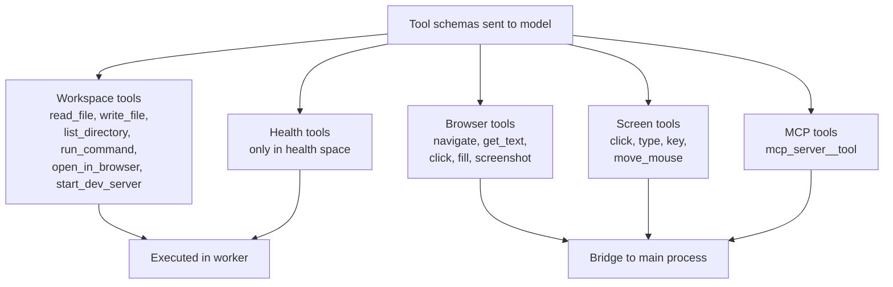

Workspace tools:

| Tool | Purpose | Execution location |
|---|---|---|
| `read_file` | Read UTF-8 file, capped | API worker |
| `write_file` | Create/update file and return diff data | API worker |
| `list_directory` | List entries, capped | API worker |
| `run_command` | Synchronous shell command, 30s timeout | API worker |
| `open_in_browser` | Open URL/file path | API worker via OS command |
| `start_dev_server` | Spawn detached background process | API worker with main tracking |

Main-hosted tools:

| Tool family | Why main process hosts it |
|---|---|
| Browser agent | Needs Electron `BrowserWindow` |
| Screen control | Needs OS automation / shell tools |
| MCP | Owns subprocess lifecycle and JSON-RPC pipes |
| Ollama model management | Needs progress events and long-running pulls |

## 15. Tool-Calling Loop

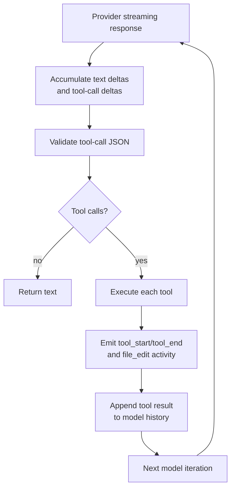

There is a 10-iteration ceiling per chat turn. This prevents unbounded
tool loops from running forever.

## 16. Worker/Main Bridge For Main-Hosted Tools

The worker and main process communicate over JSON lines. The worker writes a
special request to stdout; main handles it and writes the response back to the
worker stdin.

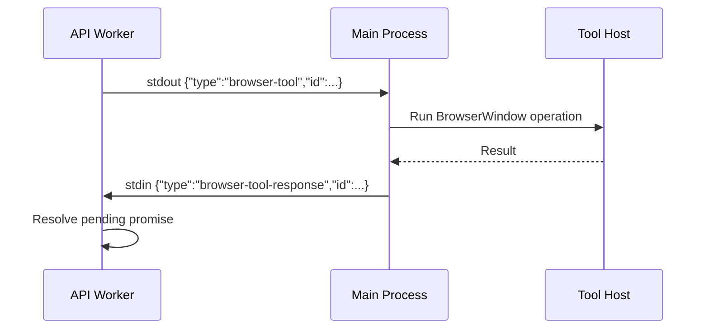

The same pattern is used for:

- `browser-tool`
- `screen-tool`
- `mcp-list`
- `mcp-call`

## 17. Permission And Safety Model

There are two related permission systems:

1. Active runtime gate in worker: observe mode blocks writes/commands and the
   worker enforces path containment for workspace file tools.
2. Pure classifier in `permissions.js`: richer mode/rule/path/command
   classification intended for careful/flow/autopilot decisions.

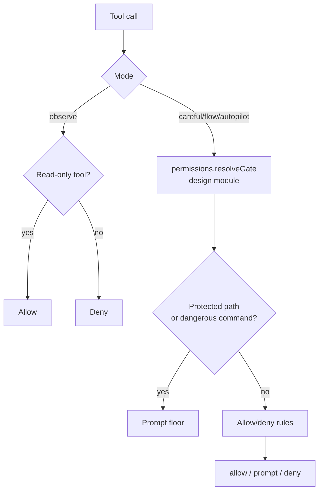

Current safety mechanisms observed in active paths:

- Renderer has no raw Node access.
- Worker checks workspace containment for file paths.
- Worker blocks commands that reference paths outside the workspace.
- Browser tools allow only HTTP(S) or about URLs.
- Browser agent uses an isolated partition, sandbox, no Node integration.
- Plan mode disables tools entirely.
- Observe mode blocks write/exec/browser/screen tools.
- Local credentials are stored with restrictive file modes when written.

Notable gap: `permissions.js` defines a rich `resolveGate()` with prompt
verdicts, dangerous command detection, allow/deny rules, and protected paths,
but the worker currently uses a simpler active gate for observe mode plus
scope checks. That richer classifier is important design groundwork but not
fully wired into a user approval dialog in the inspected path.

## 18. Workspace Scope And Task Scope

The app has two nested workspace ideas:

- `workspacePath`: folder selected by the user.
- `taskScope`: optional per-session subfolder inside the selected workspace.

If task scope is active, the renderer passes the scope path as the effective
workspace to the worker. The worker then treats that subfolder as the full
world for file and shell tools.

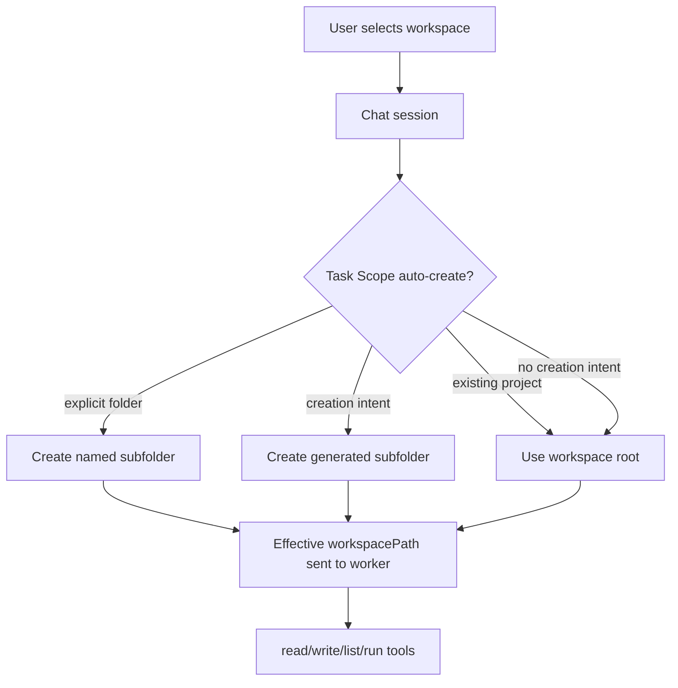

Task Scope is implemented in:

- `renderer/js/task-scope/bootstrap.js`
- `renderer/js/task-scope/scope-store.js`
- `renderer/js/task-scope/scope-detector.js`
- `renderer/js/task-scope/scope-auto.js`
- `renderer/js/task-scope/scope-ui.js`
- `electron/main.js` IPC handlers for folder creation/project detection

## 19. Data Storage View

The README says the intended canonical home is `~/.labaik`. The code is in a
migration phase: many newer files write to `~/.labaik`, while some older
features still reference `~/.alaude`.

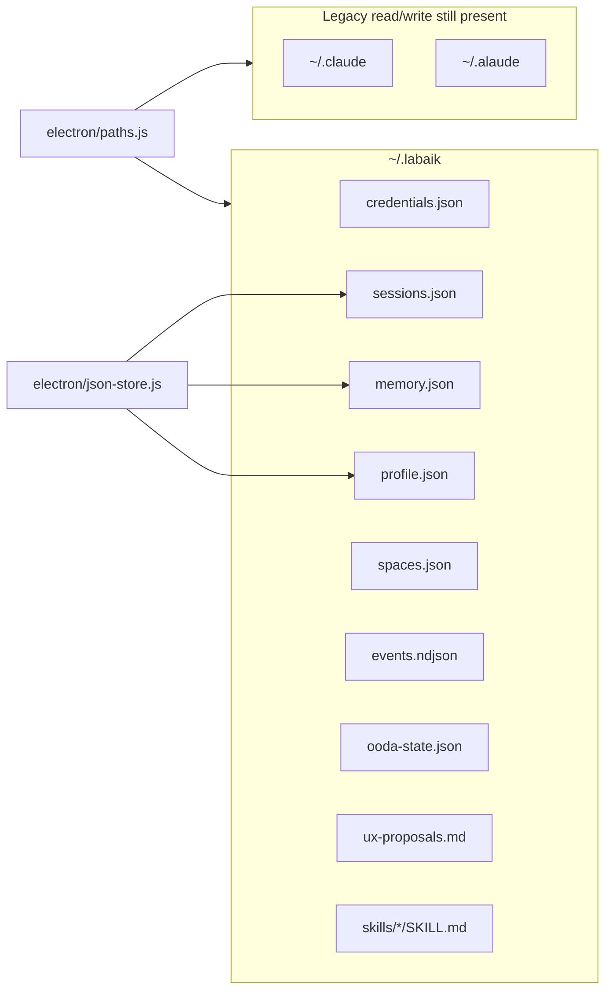

Storage components:

| Component | File(s) | Notes |
|---|---|---|
| Credentials | `~/.labaik/credentials.json` | Writes with mode `0600`; legacy fallback reads |
| Sessions | `~/.labaik/sessions.json` | Renderer uses sync fs bridge, localStorage fallback |
| Memory/profile | `~/.labaik/memory.json`, `profile.json` | Through fs-backed Storage adapter |
| Custom spaces | `~/.labaik/spaces.json` | Legacy fallback from `~/.claude` |
| OODA | `~/.labaik/events.ndjson`, state/proposals | Local-only UX observation |
| MCP servers | `~/.alaude/mcp-servers.json` | Still uses legacy path |
| Scheduled skills | `~/.alaude/skills.json` | Still uses legacy path |
| Permissions | `~/.alaude/permissions.json` | Main-level duplicate state path |

Study note: unifying the remaining `~/.alaude` paths through `paths.js` would
make the storage story simpler and match the README more tightly.

## 20. Session Persistence Design

Session persistence is unusually defensive. The renderer avoids losing chat
history by:

- Reading sessions through the filesystem bridge first.
- Falling back to localStorage only when needed.
- Mirroring small values to localStorage for compatibility.
- Refusing to overwrite non-empty storage with a fresh empty session.
- Locking persistence if restore fails or returns suspicious empty data.
- Retrying late restore after startup.
- Truncating huge message content before save.
- Removing large image data URLs from persisted sessions.
- Persisting on `beforeunload`, `pagehide`, and during active streams.

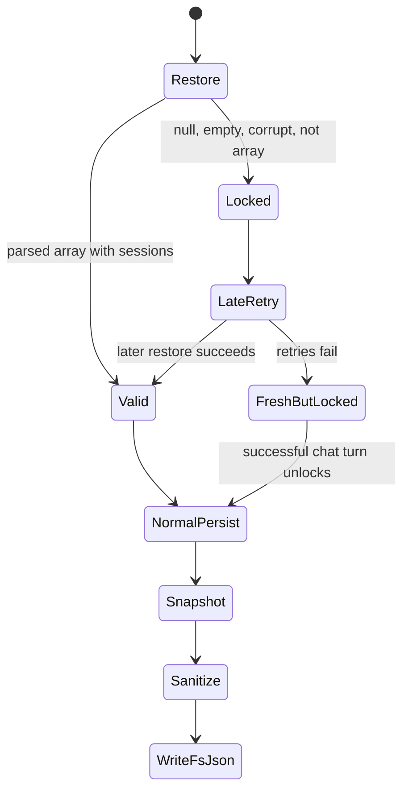

## 21. Memory And Profile System

Memory lives mostly in renderer modules. It supports automatic extraction,
manual "Remember", scope-aware recall, semantic embeddings through Ollama,
and profile promotion.

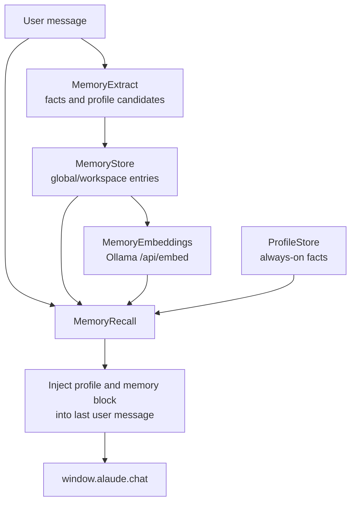

Recall modes:

- `semantic`: cosine similarity only.
- `keyword`: keyword overlap only.
- `auto`: semantic first, keyword fallback.

Incognito mode disables automatic capture and recall injection, while manual
remember still exists separately.

## 22. Spaces System

Spaces are domain-specific modes with prompt additions, quick actions, colors,
icons, placeholders, and optional file-picker actions. Built-in spaces include
general, health, finance, real estate, legal, education, and marketing. The
renderer currently has `SPACES_ENABLED = false`, so much of the space UI is
hidden while the underlying code path remains available.

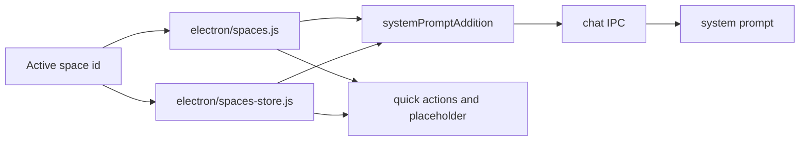

Health space is special because it enables additional health tools inside the
worker and runs red-flag screening over user and assistant text.

## 23. MCP Design

`electron/mcp.js` is a minimal MCP client. It avoids a dependency on the MCP
SDK and speaks JSON-RPC over newline-delimited stdio.

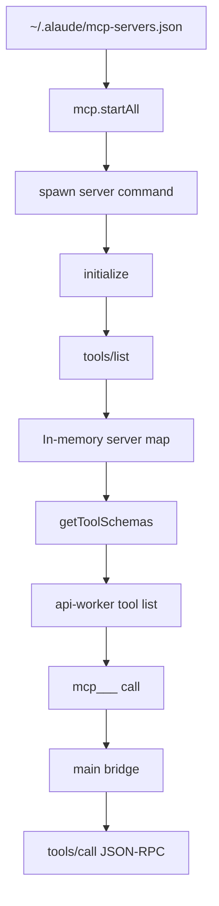

MCP tool names are namespaced as:

```text
mcp_<server>__<tool>
```

This prevents collisions with built-in tools and with tools from other MCP
servers.

## 24. Browser Agent Design

The Browser Agent reuses Electron rather than adding Playwright or Puppeteer.
It creates one BrowserWindow on first tool use and drives it with
`executeJavaScript`.

```mermaid
flowchart TB
  Model["Model tool call"] --> Worker["api-worker"]
  Worker --> Bridge["browser-tool JSON line"]
  Bridge --> Main["main.js"]
  Main --> BrowserAgent["browser-agent.js"]
  BrowserAgent --> Window["Isolated BrowserWindow<br/>partition persist:alaude-agent"]
  Window --> Action["navigate / text / click / fill / screenshot"]
  Action --> Result["Result back to model"]
```

Safety decisions:

- No Node integration.
- Context isolation on.
- Sandbox on.
- Isolated cookie partition.
- Only HTTP(S) and `about:` navigation.
- Prompt-level instructions say browser tools are opt-in.

## 25. Screen Vision And Screen Control

There are two related capabilities:

- Screen Vision: `main.js` uses macOS `screencapture` to capture a region,
  window, or full screen and passes the PNG through the file attachment path.
- Screen Control: `screen-control.js` executes click/type/key/mouse commands
  through system automation helpers.

```mermaid
flowchart LR
  Capture["capture-screen IPC"] --> Screencapture["/usr/sbin/screencapture"]
  Screencapture --> PNG["Temporary PNG"]
  PNG --> ReadFile["read-file-for-chat"]
  ReadFile --> Multimodal["Image attachment to model"]

  ModelTool["screen_* tool call"] --> Worker
  Worker --> MainBridge
  MainBridge --> ScreenControl["screen-control.js"]
  ScreenControl --> OS["macOS input events"]
```

This is powerful because the model can see and act on desktop UI, but it
also increases safety requirements. Observe mode and prompt constraints matter
more for these tools than for normal chat.

## 26. Local Ollama Runtime

Ollama support has two paths:

- Chat path: API worker calls `localhost:11434`.
- Management path: main process lists, pulls, removes, installs, and embeds.

```mermaid
flowchart TB
  Renderer["Local models UI"] --> Preload["window.alaude.ollama*"]
  Preload --> Main["main.js"]
  Main --> OllamaJS["ollama.js"]
  OllamaJS --> Tags["GET /api/tags"]
  OllamaJS --> Pull["POST /api/pull<br/>stream progress"]
  OllamaJS --> Embed["POST /api/embed"]
  OllamaJS --> Install["Download and install Ollama"]

  Chat["Chat request"] --> Worker["api-worker.js"]
  Worker --> OllamaV1["/v1 chat completions"]
  Worker --> OllamaNative["/api/chat think:false"]
```

Memory semantic search also depends on Ollama embeddings. The preferred
embedding model order starts with `all-minilm` because it is small and enough
for local memory recall.

## 27. Scheduled Skills And Folder Skills

There are two different "skills" concepts:

| Concept | File | Meaning |
|---|---|---|
| Scheduled skills / routines | `electron/skills.js` | Prompt + cron expression that runs automatically |
| Folder skills | `electron/folder-skills.js` | User-callable prompt templates in `~/.labaik/skills/<slug>/SKILL.md` |

```mermaid
flowchart TB
  CronSkills["Scheduled routines"] --> SkillsFile["~/.alaude/skills.json"]
  SkillsFile --> Scheduler["30s polling scheduler"]
  Scheduler --> Fire["Due skill"]
  Fire --> Worker["Same API worker chat pipeline"]
  Worker --> Result["skill-ran event to renderer"]

  FolderSkills["Folder skills"] --> SkillsRoot["~/.labaik/skills"]
  SkillsRoot --> Discover["Discover SKILL.md"]
  Discover --> Palette["Command palette inserts prompt"]
```

Scheduled routines run serially to avoid hammering providers.

## 28. Crew And Council Modes

The renderer can run multiple model calls in parallel:

- Crew mode: fixed roles such as specialist lanes, then synthesis.
- Council mode: selected models respond in separate lanes; user can pick or
  synthesize.

```mermaid
sequenceDiagram
  participant R as Renderer
  participant M1 as Model Lane 1
  participant M2 as Model Lane 2
  participant M3 as Model Lane 3
  participant S as Synthesis Model

  R->>M1: chat(history, model1, lane messageId)
  R->>M2: chat(history, model2, lane messageId)
  R->>M3: chat(history, model3, lane messageId)
  M1-->>R: lane answer
  M2-->>R: lane answer
  M3-->>R: lane answer
  alt user requests synthesis
    R->>S: summarize all lane answers
    S-->>R: unified answer
  end
```

The important implementation detail is the message id. Each lane gets a unique
message id so streaming token/activity events route to the correct DOM node.

## 29. OODA Local UX Loop

`electron/ooda.js` logs local UX events and derives simple outcome signals.
It writes proposals for humans to review. It does not auto-change UI behavior.

```mermaid
flowchart LR
  Observe["Observe<br/>events.ndjson"] --> Orient["Orient<br/>pair send/complete,<br/>derive outcomes"]
  Orient --> Decide["Decide<br/>rule-based proposal"]
  Decide --> Act["Act<br/>write ux-proposals.md"]
  Act --> Human["Human reviews manually"]
```

Tracked examples:

- chat sent/completed/error
- response copied
- retry detected
- session ended
- model switched

Outcome scoring rewards clean success and copied responses, and penalizes
errors, retries, and abandonment.

## 30. Packaging And Build Directory

The user-provided `build/` directory is part of packaging, not the main app
logic.

```mermaid
flowchart TB
  PackageJson["package.json electron-builder config"] --> Files["Packaged files"]
  Files --> Electron["electron/**/*"]
  Files --> Renderer["renderer/**/*"]
  Files --> Build["build/**/*"]
  Build --> Icon["build/icons/icon.png"]
  Build --> Entitlements["build/entitlements.mac.plist"]
  Build --> PPT["build/ppt presentation assets"]
  PackageJson --> Dist["dist DMG/zip output"]
  PackageJson --> Scripts["scripts/notarize.js<br/>scripts/ad-hoc-sign.js"]
```

`package.json` packages these folders:

- `electron/**/*`
- `renderer/**/*`
- `build/**/*`

macOS packaging uses:

- app id: `ai.labaik.desktop`
- product name: `Labaik`
- hardened runtime
- entitlements: `build/entitlements.mac.plist`
- app icon: `build/icons/icon.png`
- targets: DMG and ZIP for arm64 and x64

## 31. Security Boundary View

```mermaid
flowchart TB
  subgraph UntrustedOrLessTrusted["Less trusted surface"]
    UserContent["Model output and rendered chat"]
    WebPages["Browser agent pages"]
  end

  subgraph Renderer["Renderer"]
    UI["No raw Node access"]
    Bridge["window.alaude API only"]
  end

  subgraph Main["Main Process"]
    IPC["IPC validation points"]
    OSAccess["OS and filesystem access"]
    ToolHosts["Browser/screen/MCP/Ollama hosts"]
  end

  subgraph Worker["API Worker"]
    ModelLoop["LLM calls and tool loop"]
    WorkspaceGuard["Workspace path guard"]
  end

  UserContent --> UI
  WebPages --> ToolHosts
  UI --> Bridge
  Bridge --> IPC
  IPC --> Worker
  Worker --> WorkspaceGuard
  Worker --> ToolHosts
  IPC --> OSAccess
```

Main risks to study:

- Tool execution can affect local files and commands.
- Screen tools can affect the real desktop.
- Browser tool runs JavaScript inside web pages, although in an isolated
  BrowserWindow.
- The renderer is large and monolithic; accidental global state bugs are
  easier in a 17k-line HTML file.
- There are duplicate/legacy chat/tool implementations in `main.js`, while
  the live path uses `api-worker.js`.
- Some storage paths still use `~/.alaude` while the intended canonical home
  is `~/.labaik`.

## 32. Important Files To Study In Order

Study path for understanding the system deeply:

1. `package.json`
   - Understand app identity, dependencies, build packaging, included files.

2. `README.md`
   - Understand product intent, user-facing features, data locations.

3. `electron/main.js`
   - Understand app startup, IPC handlers, worker bridge, local services.

4. `electron/preload.js`
   - Learn the renderer capability surface.

5. `electron/api-worker.js`
   - Study provider calls, prompt building, streaming, tool loops.

6. `electron/provider-registry.js`
   - Understand model routing and OpenAI-compatible providers.

7. `renderer/index.html`
   - Study session state, send flow, rendering, crew/council, persistence.

8. `renderer/js/bootstrap.js`
   - See how the newer modular renderer subsystems attach to the monolith.

9. `renderer/js/memory/*`
   - Understand memory extraction, recall, embeddings, profile integration.

10. `renderer/js/task-scope/*`
    - Understand scoped workspace behavior.

11. `electron/mcp.js`, `browser-agent.js`, `screen-control.js`, `ollama.js`
    - Study tool-host subsystems.

12. `electron/permissions.js`
    - Study the target permission model and what remains to wire.

## 33. Live Chat Function Call Graph

```mermaid
flowchart TD
  Send["renderer sendMessage"] --> CallAI["callAI / callCrew / callCouncil"]
  CallAI --> Sanitize["sanitizeHistoryForApi"]
  Sanitize --> Memory["__memInjectIntoLastUser"]
  Memory --> Scope["task scope effective workspace"]
  Scope --> WindowChat["window.alaude.chat"]
  WindowChat --> IPCChat["main ipcMain.handle chat"]
  IPCChat --> GetWorker["getWorker"]
  GetWorker --> WorkerReq["stdin JSON request"]
  WorkerReq --> HandleChat["api-worker handleChat"]
  HandleChat --> ProviderFunc["chatAnthropic / chatOpenAI / chatGemini / chatOllamaNative"]
  ProviderFunc --> ToolLoop["tool loop"]
  ToolLoop --> Final["final text"]
  Final --> RendererUpdate["replace streaming message and persist"]
```

## 34. Tool Execution Call Graph

```mermaid
flowchart TD
  ModelTool["Model emits tool call"] --> Parse["Parse tool args"]
  Parse --> ActivityStart["Emit tool_start"]
  ActivityStart --> Dispatch{"Tool prefix/name"}
  Dispatch -- read/write/list/run/open/start --> WorkspaceTool["Worker executes workspace tool"]
  Dispatch -- browser_* --> BrowserBridge["Bridge to main browser-agent"]
  Dispatch -- screen_* --> ScreenBridge["Bridge to main screen-control"]
  Dispatch -- mcp_* --> MCPBridge["Bridge to main MCP client"]
  Dispatch -- health tools --> HealthTool["Worker health modules"]
  WorkspaceTool --> ActivityEnd["Emit tool_end"]
  BrowserBridge --> ActivityEnd
  ScreenBridge --> ActivityEnd
  MCPBridge --> ActivityEnd
  HealthTool --> ActivityEnd
  ActivityEnd --> ToolResult["Append tool result to model history"]
```

## 35. Data Model Sketch

This is an inferred model from code, not a formal schema.

```mermaid
erDiagram
  SESSION ||--o{ MESSAGE : contains
  SESSION {
    number id
    string title
    boolean titleIsAI
    string taskScope
    string taskScopeMode
    number parentId
    number forkPoint
  }
  MESSAGE {
    string role
    string content
    boolean streaming
    string model
    number ts
    string uxMessageId
    string reasoning_content
  }
  MESSAGE ||--o{ FILE_ATTACHMENT : has
  MESSAGE ||--o{ FILE_EDIT : has
  MEMORY {
    string id
    string text
    string scope
    string workspacePath
    number createdAt
    vector embedding
  }
  PROFILE {
    string id
    string text
    string category
  }
  SPACE {
    string id
    string name
    string systemPromptAddition
  }
  SKILL {
    string id
    string name
    string prompt
    string cron
    boolean enabled
  }
```

## 36. Deployment View

```mermaid
flowchart TB
  Dev["Developer machine"] --> NpmStart["npm start / electron ."]
  Dev --> BuildMac["npm run build:mac"]
  BuildMac --> ElectronBuilder["electron-builder"]
  ElectronBuilder --> Sign["Developer ID signing"]
  Sign --> Notarize["scripts/notarize.js"]
  Notarize --> Dist["dist/*.dmg and *.zip"]

  User["End user machine"] --> App["Labaik.app"]
  App --> UserData["Electron userData"]
  App --> LabaikHome["~/.labaik"]
  App --> Providers["Provider APIs"]
  App --> Ollama["Optional local Ollama"]
```

## 37. Architectural Strengths

- Clear local-first product stance.
- Provider routing is centralized and readable.
- Worker process protects UI from many network/provider failures.
- Streaming activity events make long tool runs visible.
- Task Scope is a strong containment design for generated projects.
- Session persistence is unusually careful about crash/data-loss cases.
- Memory/profile modules are moving the renderer toward better separation.
- MCP support is simple and understandable.
- Browser agent avoids a heavy browser automation dependency.
- Rich-output support makes the app more than plain chat.

## 38. Architectural Friction And Risks

These are study notes, not criticism for its own sake.

| Area | Observation | Why it matters |
|---|---|---|
| Renderer monolith | `index.html` is about 17k lines | Hard to test, refactor, and reason about |
| Duplicate code | `main.js` still has older chat/tool functions | New contributors may study dead paths |
| Permission wiring | Rich classifier exists but active gate is simpler | Approval UX and enforcement can drift |
| Storage migration | Some modules still write `~/.alaude` | README says `~/.labaik`, mental model splits |
| Tool safety | `run_command` uses shell string execution | Needs strong command/path gating |
| Browser tools | JS execution in pages is powerful | Keep strict scheme and isolation rules |
| Screen tools | Can operate the real desktop | Needs explicit user intent and visible state |
| Main process size | `main.js` owns many unrelated systems | Hard to isolate failures |
| Testing surface | Few visible automated tests | Important for persistence/tool regressions |

## 39. Suggested Future Architecture

If this codebase keeps growing, a good next design would split by runtime and
domain:

```text
electron/
+-- main/
|   +-- windows.js
|   +-- ipc/
|   +-- credentials.js
|   +-- storage.js
|   +-- worker-bridge.js
|   +-- tools/
|   +-- services/
|
+-- worker/
|   +-- chat-router.js
|   +-- prompt-builder.js
|   +-- providers/
|   +-- tool-loop.js
|   +-- tools/
|
renderer/
+-- app/
|   +-- sessions/
|   +-- chat/
|   +-- composer/
|   +-- models/
|   +-- memory/
|   +-- task-scope/
|   +-- rich-renderers/
```

```mermaid
flowchart LR
  MainMonolith["main.js monolith"] --> MainModules["main modules"]
  WorkerMixed["api-worker.js mixed concerns"] --> WorkerModules["provider, prompt,<br/>tool-loop modules"]
  RendererMonolith["index.html monolith"] --> RendererModules["chat, composer,<br/>sessions, renderers"]
  LegacyPaths["mixed ~/.alaude and ~/.labaik"] --> UnifiedPaths["paths.js everywhere"]
  PermissionDesign["permissions.js design"] --> RuntimeApproval["one approval pipeline"]
```

## 40. Study Checklist

Use these questions to test whether you understand the code:

1. What happens between clicking Send and receiving the first streamed token?
2. Which process is allowed to touch the filesystem directly?
3. Why is there an API worker instead of doing provider calls in main?
4. How does the app decide whether `deepseek-r1:7b` is Ollama or cloud?
5. How does a tool call from a model become a filesystem edit?
6. How are MCP tools discovered and namespaced?
7. What changes when Plan mode is enabled?
8. What changes when Task Scope is active?
9. Which storage files are canonical and which are legacy?
10. What is the difference between scheduled skills and folder skills?
11. Why does session persistence lock itself after a suspicious restore?
12. How do Crew/Council lanes keep streaming events separated?
13. Which tools run in the worker and which must bridge to main?
14. What would you refactor first to make this app easier to maintain?

## 41. One-Page Mental Model

```mermaid
flowchart TB
  User["User"] --> Renderer["Renderer owns experience"]
  Renderer --> State["sessions/messages/memory/task-scope"]
  Renderer --> Preload["safe bridge"]
  Preload --> Main["Main owns desktop capabilities"]
  Main --> Worker["Worker owns model/tool loop"]
  Worker --> Provider["Provider or Ollama"]
  Provider --> Worker
  Worker --> Main
  Main --> Renderer
  Renderer --> User

  Worker --> WorkspaceTools["Workspace tools"]
  Worker --> MainTools["Main-hosted tools"]
  MainTools --> Browser["Browser"]
  MainTools --> Screen["Screen"]
  MainTools --> MCP["MCP"]
  MainTools --> OllamaMgr["Ollama manager"]

  Renderer --> LocalData["Local data"]
  Main --> LocalData
  LocalData --> Home["~/.labaik mostly<br/>some legacy ~/.alaude"]
```

Short version: Labaik is a local desktop shell around many providers. The UI
is state-heavy, the main process is a capability broker, and the API worker is
the agent runtime.

